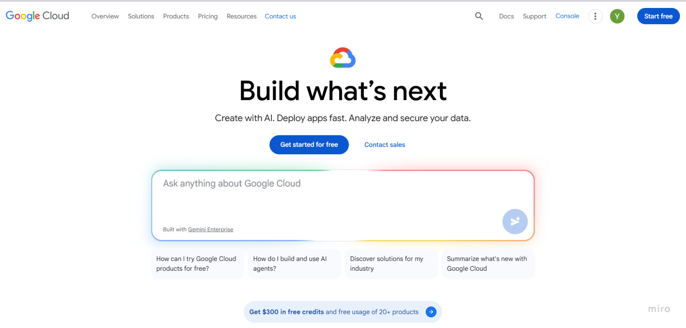
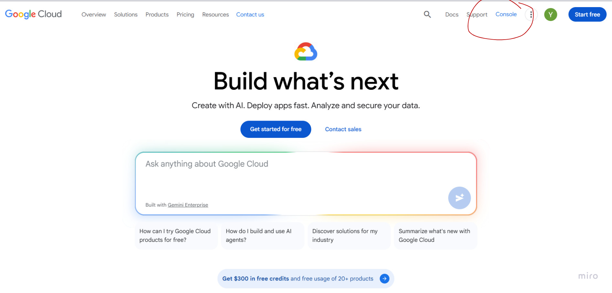

## Overview

This guide walks you through obtaining a YouTube Data API v3 token and connecting it to Replai. You will create a Google Cloud project, enable the YouTube API, generate OAuth credentials, and configure them in Replai.

## Prerequisites

- A Google account
- Access to [Google Cloud Console](https://console.cloud.google.com)

---

## 1. Access Google Cloud Console

### Step 1: Open Google Cloud

Open your browser and go to [cloud.google.com](https://cloud.google.com).

### Step 2: Click Console

Click **Console** in the top-right corner of the page.

### Step 3: Open the Dashboard

You will see the Google Cloud Dashboard.

---

## 2. Create a Google Cloud Project

### Step 4: Click Select a Project

Click **Select a project** in the top navigation bar.

### Step 5: Click New Project

In the project selector dialog, click **New Project**.

### Step 6: Enter Project Name

Enter a project name (e.g., `Replai YouTube`) and click **Create**.

### Step 7: Wait for Project Creation

Wait for the project to be created. You will see a notification when it's ready.

### Step 8: Select the New Project

Click **Select a project** again and choose the project you just created.

### Step 8: Select the Project 

Click the project you just created.

---

## 3. Enable YouTube Data API v3

### Step 9: Open Navigation Menu

Click the hamburger menu (☰) in the top-left corner.

### Step 10: Go to APIs & Services

Navigate to **APIs & Services** → **Library**.

### Step 11: Go to APIs & Services

Navigate to **APIs & Services** → **Library**.

### Step 12: Search for YouTube Data API

In the API Library, search for `YouTube Data API v3`.

### Step 13: Select YouTube Data API v3

Click on **YouTube Data API v3** from the search results.

### Step 14: Enable the API

Click the **Enable** button.

---

## 4. Create OAuth Consent Screen

### Step 15: Go to OAuth Consent Screen

In the left sidebar, click **OAuth consent screen**.

### Step 16: Get start

Select **Get start button** and Click **Create**.

### Step 17: Fill App Information

Enter the required app information: App name, User support email. Click **Next**.

### Step 18: Select user type

Click **External** and click **Next**.

### Step 19: Contact information

Add your email and click **Next**.

### Step 20: Finish

Agree Google user data policy and click **Continue**.

### Step 21: Create

Click on **Create**.

---

## 5. Create OAuth Credentials

### Step 21: Go to Overview

In the left sidebar, click **Overview**.

### Step 22: Click Create Credentials

Click **Create OAuth client**.

### Step 23: Select Application Type

Select **Web application** as the application type.

### Step 24: Configure Redirect URI

Enter the name and add the **https://developers.google.com/oauthplayground/** redirect URI in **Authorized redirect URIs**. Click **Create**.

### Step 25: Copy Client ID and Secret

A dialog will appear with your **Client ID** and **Client Secret**. Copy both values.

---
<!-- 
## 6. Connect to Replai

### Step 26: Open Replai Settings

Go to Replai and navigate to **Settings** → **Integrations**.

### Step 27: Select YouTube

Click on the **YouTube** integration.

### Step 28: Enter Credentials

Paste your **Client ID** and **Client Secret** into the corresponding fields.

### Step 29: Authorize Access

Click **Connect** and authorize access in the Google consent screen.

### Step 30: Connection Successful

You will see a confirmation that YouTube is connected to Replai.

---

## Configuration

After connecting, you can configure the following settings in Replai:

- **Auto-reply to comments** — Enable or disable automatic responses to YouTube comments.
- **Response delay** — Set a delay before sending replies.
- **Comment filters** — Filter which comments trigger a response.

--- -->

## Limitations

- **API Quota**: YouTube Data API v3 has a daily quota of 10,000 units. Each API call costs a certain number of units.
- **OAuth Token Expiry**: Access tokens expire after 1 hour. Replai handles token refresh automatically.
- **Test Mode**: While your app is in "Testing" status, only added test users can authorize. Submit for verification to allow all users.